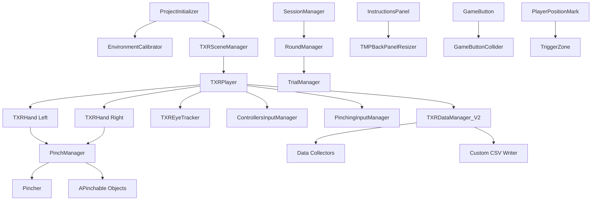

# TAUXR Research Template - Component Documentation

## Table of Contents

1. [Introduction](#introduction)
2. [Core Components](#core-components)
   - [Base Scene](#21-base-scene)
   - [TXRPlayer](#211-txrplayer)
   - [TXRSceneManager](#212-txrscenemanager)
   - [TXRDataManager_V2](#213-txrdatamanager_v2)
   - [TXR_RoomCalibrator](#214-txr_roomcalibrator)
   - [TAUXR Scene Template](#215-tauxr-scene-template)
3. [Flow Management System](#3-flow-management-system)
4. [Utilities](#4-utilities)
   - [General Scripts](#41-general-scripts)
   - [Shared Utils](#42-shared-utils-demo-experiments)
   - [Extensions](#43-extensions)
   - [Juice Animations](#44-juice-animations)
   - [Shapes Alternatives](#45-shapes-alternatives)
5. [Detectors](#5-detectors)
6. [Demo Experiments](#6-demo-experiments)
7. [Meta Components](#7-meta-components)

---

## Introduction

### Overview

The **TAUXR Research Template** is a comprehensive Unity XR template designed specifically for Meta Quest research experiments. It provides a complete framework for building VR research applications with built-in support for:

- Hand tracking and gesture recognition
- Eye tracking and gaze analysis
- Face expression tracking
- Comprehensive data collection and export
- Scene management and flow control
- Room-scale calibration
- Multiple interaction paradigms (pinching, controllers, touch)

**Core Philosophy - "Clear Box" Design**: Unlike other solutions that provide black-box classes you use from outside, TAUXR is designed as a **transparent, clear box** where researchers **own and modify every part of their experiment**. The template provides structure, base classes, and examples, but you are expected to copy, modify, and customize the code for your specific research needs. Everything is open and transparent - you understand exactly how your experiment runs under the hood.

### Prerequisites

- Unity 2021.3 or later
- Meta Quest SDK (OVR)
- Meta Quest headset (Quest 2, Quest Pro, Quest 3)
- Basic knowledge of Unity and C#

### Project Structure

The template is organized into several main directories:

```
Assets/TAUXR/
├── Base Scene/          # Core persistent scene and systems
├── Flow Management/     # Session/Round/Trial flow control
├── Utilities/           # Helper scripts and utilities
├── Detectors/           # Interaction detection system
├── Demo Experiments/    # Example implementations
└── Meta componentrs/    # Meta-specific integrations

Assets/Project Folder/
└── New TAUXRScene [Duplicate].unity  # Template for creating experiment scenes
```

### Key Design Patterns

- **Singleton Pattern**: Most managers use `TXRSingleton<T>` for global access
- **Async/Await**: Uses UniTask for asynchronous operations
- **Component-Based**: Modular design with clear separation of concerns
- **Clear Box Philosophy**: You own and modify your experiment code - everything is transparent and open

---

## Core Components

### 2.1 Base Scene

**Location**: `Assets/TAUXR/Base Scene/`

The Base Scene is the foundational scene that loads first and persists throughout the entire VR experience. It contains all core systems that need to remain active across different experiment scenes.

#### Key Files

- `Base Scene.unity` / `Base Scene With Meta Interactions 2.unity` - The base scene files
- `ProjectInitializer.cs` - Entry point that initializes the experience

#### ProjectInitializer

**Location**: `Assets/TAUXR/Base Scene/ProjectInitializer.cs`

The entry point of the entire application. Coordinates calibration and scene loading.

**Key Properties**:
- `_shouldProjectUseCalibration` - Whether the project should be calibrated to physical space
- `_shouldCalibrateOnEditor` - Whether to run calibration in the Unity Editor

**Usage**:
```csharp
// ProjectInitializer automatically starts the experience
// It handles:
// 1. Room calibration (if enabled)
// 2. Scene manager initialization
// 3. First scene loading
```

**Dependencies**:
- `EnvironmentCalibrator` - For room calibration
- `TXRSceneManager` - For scene management

#### Sub-Components

The Base Scene contains several major subsystems:

1. **TXRPlayer** - Player controller and tracking systems
2. **TXRSceneManager** - Scene loading and transitions
3. **TXRDataManager_V2** - Data collection and export
4. **TXR_RoomCalibrator** - Room-scale calibration

---

### 2.1.1 TXRPlayer

**Location**: `Assets/TAUXR/Base Scene/TXRPlayer/`

**Purpose**: Central player controller managing all player-related systems including hand tracking, eye tracking, face tracking, and input management.

**Key Script**: `TXRPlayer.cs`

**Inheritance**: `TXRSingleton<TXRPlayer>`

#### Overview

TXRPlayer is the main singleton that provides access to all player-related functionality. It initializes and manages hand tracking, eye tracking, face tracking, and input systems.

#### Key Properties

```csharp
// Player Trackables
public Transform PlayerHead { get; }
public Transform RightHand { get; }
public Transform LeftHand { get; }

// Hand Tracking
public TXRHand HandLeft { get; }
public TXRHand HandRight { get; }

// Eye Tracking
public TXREyeTracker EyeTracker { get; }
public bool IsEyeTrackingEnabled { get; }
public Transform FocusedObject { get; }  // Object currently being looked at
public Vector3 EyeGazeHitPosition { get; }  // World position of gaze hit
public Transform RightEye { get; }
public Transform LeftEye { get; }

// Face Tracking
public OVRFaceExpressions OVRFace { get; }
public bool IsFaceTrackingEnabled { get; }

// Input Managers
public ControllersInputManager ControllersInputManager { get; }
public PinchingInputManager PinchingInputManager { get; }
```

#### Key Methods

```csharp
// View fading
public async UniTask FadeViewToColor(Color targetColor, float duration)

// Player positioning
public void RepositionPlayer(PlayerRepositioner repositioner)

// Passthrough control
public void SetPassthrough(bool state)

// Hand utilities
public Transform GetHandFingerCollider(HandType handType, FingerType fingerType)
```

#### Usage Example

```csharp
// Access player instance
TXRPlayer player = TXRPlayer.Instance;

// Fade to black
await player.FadeViewToColor(Color.black, 1.0f);

// Check if player is looking at something
if (player.FocusedObject != null)
{
    Debug.Log($"Looking at: {player.FocusedObject.name}");
}

// Get finger position
Transform indexFinger = player.GetHandFingerCollider(HandType.Right, FingerType.Index);
```

#### Sub-Components

##### TXR Hand

**Location**: `Assets/TAUXR/Base Scene/TXRPlayer/TXR Hand/`

**Key Script**: `TXRHand.cs`

Manages hand tracking via OVR Skeleton, hand colliders for interaction, pinch detection, and hand visibility.

**Key Properties**:
```csharp
public HandType HandType { get; }
public Pincher Pincher { get; }
public PinchManager PinchManager { get; }
public SkinnedMeshRenderer _handSMR { get; }
```

**Key Methods**:
```csharp
public void Init()  // Initialize hand tracking
public void UpdateHand()  // Update hand state (called every frame)
public Transform GetFingerCollider(FingerType fingerType)  // Get finger collider transform
public void SetHandVisibility(bool state)  // Show/hide hand mesh
```

**Sub-Components**:
- **HandCollider** (`HandCollider.cs`) - Individual finger colliders that track hand bone positions
- **Pincher** (`Pincher.cs`) - Calculates pinch strength and position between thumb and index finger

**Pincher Details**:
- Tracks distance between thumb tip (bone index 5) and index tip (bone index 10)
- Calculates pinch strength (0-1) based on finger distance
- Positioned at midpoint between thumb and index finger
- Uses sphere collider to detect pinchable objects

**Usage Example**:
```csharp
// Check if hand is pinching
bool isPinching = TXRPlayer.Instance.HandRight.PinchManager.IsHandPinchingThisFrame();

// Get current pinch strength (0-1)
float strength = TXRPlayer.Instance.HandRight.Pincher.Strength;
```

##### TXR Eye Tracker

**Location**: `Assets/TAUXR/Base Scene/TXRPlayer/TXR Eye Tracker/`

**Key Script**: `TXREyeTracker.cs`

Provides eye gaze tracking, focused object detection via raycast, and eye position information.

**Key Properties**:
```csharp
public Transform FocusedObject { get; }  // Object currently being looked at
public Vector3 EyeGazeHitPosition { get; }  // World position where gaze hits
public Transform RightEye { get; }
public Transform LeftEye { get; }
public Vector3 EyePosition { get; }  // Average position of both eyes
```

**Key Methods**:
```csharp
public void Init()  // Initialize eye tracking
public void UpdateEyeTracker()  // Update eye tracking (called every frame)
```

**How It Works**:
1. Uses `OVREyeGaze` component on right eye
2. Checks confidence threshold (default: 0.5)
3. Casts ray from midpoint between eyes forward
4. Detects focused object via raycast
5. Returns hit position and focused transform

**Usage Example**:
```csharp
// Check what player is looking at
if (TXRPlayer.Instance.FocusedObject != null)
{
    Debug.Log($"Looking at: {TXRPlayer.Instance.FocusedObject.name}");
    Debug.Log($"Hit position: {TXRPlayer.Instance.EyeGazeHitPosition}");
}
```

##### Controllers

**Location**: `Assets/TAUXR/Base Scene/TXRPlayer/Controllers/`

**Key Script**: `ControllersInputManager.cs`

**Inheritance**: `AInputManager`

Handles controller input (Quest controllers) including trigger presses and haptic feedback.

**Key Methods**:
```csharp
public override bool IsLeftHeld()  // Is left trigger held
public override bool IsRightHeld()  // Is right trigger held
public async UniTask SetControllersVibration(float vibrationStrength, float duration)
```

**Usage Example**:
```csharp
// Check if controller trigger is pressed
if (TXRPlayer.Instance.ControllersInputManager.IsRightHeld())
{
    Debug.Log("Right trigger held");
}

// Provide haptic feedback
await TXRPlayer.Instance.ControllersInputManager.SetControllersVibration(0.5f, 0.2f);
```

##### Pinching System

**Location**: `Assets/TAUXR/Base Scene/TXRPlayer/Pinching/`

The pinching system provides hand-based interaction through pinch gestures.

**Key Components**:

1. **PinchingInputManager** (`PinchingInputManager.cs`)
   - Wraps pinch detection for use as input manager
   - Inherits from `AInputManager`
   - Provides `IsLeftHeld()` and `IsRightHeld()` based on pinch state

2. **PinchManager** (`PinchManager.cs`)
   - Manages pinch detection and pinchable object interaction
   - Tracks pinchable objects in range
   - Handles pinch enter/exit events
   - Selects which object to pinch based on priority

**Key Properties**:
```csharp
public APinchable PinchedObject { get; }  // Currently pinched object
public PinchingConfiguration Configuration { get; }  // Pinch thresholds and settings
public Pincher Pincher { get; }  // Pincher component
public HandType HandType { get; }  // Left or Right
```

**Key Methods**:
```csharp
public void HandlePinching()  // Called every frame to update pinch state
public APinchable ChooseObjectToPinch()  // Selects object to pinch from range
public void AddPinchableInRange(APinchable pinchable)  // Register pinchable object
public void RemovePinchableInRange(APinchable pinchable)  // Unregister pinchable object
public bool IsHandPinchingThisFrame()  // Check if currently pinching
```

3. **APinchable** (`APinchable.cs`)
   - Abstract base class for objects that can be pinched
   - Requires `Collider` and `Rigidbody` components
   - Implements priority-based selection system

**Key Properties**:
```csharp
public PinchManager PinchingHandPinchManager { get; set; }  // Which hand is pinching
public Collider Collider { get; }  // Object's collider
public int Priority { get; set; }  // Selection priority (higher = selected first)
public virtual float PinchExitThreshold => 0.97f  // Pinch strength to release
```

**Virtual Methods** (override in subclasses):
```csharp
public virtual void OnHoverEnter(PinchManager pinchManager)  // Hand enters range
public virtual void OnHoverStay(PinchManager pinchManager)  // Hand stays in range
public virtual void OnHoverExit(PinchManager pinchManager)  // Hand exits range
public virtual bool CanBePinched(PinchManager pinchManager)  // Check if can be pinched
public virtual void OnPinchEnter(PinchManager pinchManager)  // Pinch started
public virtual void OnPinchExit()  // Pinch released
```

**Usage Example**:
```csharp
// Create a pinchable object
public class MyPinchableObject : APinchable
{
    public override void OnPinchEnter(PinchManager pinchManager)
    {
        Debug.Log("Object pinched!");
        // Your custom logic here
    }
    
    public override void OnPinchExit()
    {
        Debug.Log("Object released!");
    }
}

// Wait for pinch gesture
await TXRPlayer.Instance.PinchingInputManager.WaitForHoldAndRelease(HandType.Right, 1.0f);
```

**PinchingConfiguration**:
- `PinchEnterThreshold` - Pinch strength to start pinching (default: ~0.7)
- `PinchExitThreshold` - Pinch strength to release (default: ~0.3)
- `PinchMinDistance` - Minimum distance for full pinch
- `PinchMaxDistance` - Maximum distance for no pinch
- `MinimumTimeBetweenPinches` - Cooldown between pinches

---

### 2.1.2 TXRSceneManager

**Location**: `Assets/TAUXR/Base Scene/SceneManagement/`

**Purpose**: Manages scene loading, unloading, and transitions with fade effects.

**Key Script**: `TXRSceneManager.cs`

**Inheritance**: `TXRSingleton<TXRSceneManager>`

#### Overview

TXRSceneManager handles additive scene loading, allowing the Base Scene to persist while experiment scenes are loaded and unloaded. It provides smooth transitions with fade effects and automatic player repositioning.

#### Key Properties

```csharp
public int BaseSceneIndex { get; set; }  // Build index of base scene
public int FirstSceneToLoadIndex { get; set; }  // First scene to load after base
public string CurrentSceneName { get; }  // Name of currently active scene
```

#### Key Methods

```csharp
// Initialize scene manager
public void Init(bool isProjectUsingCalibration)

// Load a scene by build index
private async UniTask LoadActiveScene(int sceneBuildIndex)

// Load a scene by name
private async UniTask LoadActiveScene(string sceneName)

// Switch to a different scene (unloads current, loads new)
public async UniTask SwitchActiveScene(string sceneName)

// Unload current active scene
private async UniTask UnloadActiveScene()

// Restart the active scene
public async void RestartActiveScene()
```

#### Features

1. **Additive Scene Loading**: Loads experiment scenes additively, keeping Base Scene active
2. **Fade Transitions**: Automatic fade to black/clear during scene transitions
3. **Player Repositioning**: Automatically repositions player using `PlayerRepositioner` components
4. **Editor Support**: Handles both editor and build scenarios differently

#### Usage Example

```csharp
// Initialize (usually called by ProjectInitializer)
TXRSceneManager.Instance.Init(false);  // false = not using calibration

// Switch to a different scene
await TXRSceneManager.Instance.SwitchActiveScene("MyExperimentScene");

// Get current scene name
string current = TXRSceneManager.Instance.CurrentSceneName;
```

#### PlayerRepositioner

**Location**: `Assets/TAUXR/Base Scene/SceneManagement/PlayerRepositioner.cs`

A component placed in experiment scenes to define where the player should be positioned when the scene loads.

**Properties**:
- `Type` - `ERepositionType` (FloorLevel or FullPosition)
- Transform position and rotation define target player position

**Usage**: Simply add this component to a GameObject in your experiment scene at the desired player spawn location.

---

### 2.1.5 TAUXR Scene Template

**Location**: `Assets/Project Folder/New TAUXRScene [Duplicate].unity`

**Purpose**: Template scene that serves as the starting point for creating new experiment scenes. This scene is designed to be duplicated and opened additively with a Base Scene.

#### Overview

The TAUXR Scene Template is a pre-configured scene template that contains the essential components needed for any experiment scene. **This is your starting point - you own and modify everything in your duplicated scene.**

**Important Philosophy**: TAUXR is a **"clear box"** template, not a black box. Unlike other solutions where you use classes from outside, TAUXR is designed for researchers to **own and modify every part of their experiment**. The template provides structure and examples, but you are expected to customize, extend, and modify the scripts to fit your research needs.

#### How to Use

1. **Duplicate the Template**:
   - In Unity Project window, navigate to `Assets/Project Folder/`
   - Right-click on `New TAUXRScene [Duplicate].unity`
   - Select "Duplicate"
   - Rename it to your experiment name (e.g., `MyExperimentScene.unity`)

2. **Add to Build Settings**:
   - Open `File → Build Settings`
   - Click "Add Open Scenes" or drag your new scene into the build list
   - Ensure it's placed after the Base Scene in the build order

3. **Configure Scene Manager**:
   - In the Base Scene, select the `SceneManager` GameObject
   - Set `FirstSceneToLoadIndex` to the build index of your new scene
   - Or use `SwitchActiveScene()` with your scene name

4. **Own Your Scripts**:
   - The template includes empty `SceneReferencer` and Flow Management scripts
   - **You own these scripts** - modify them directly for your experiment
   - No need to create new classes - just fill in the existing ones

#### What's Included

The template scene comes pre-configured with:

1. **SceneReferencer** - An empty singleton component for storing scene-specific references
   - **You own this script** - add your experiment-specific references directly
   - Example: stimulus objects, target positions, UI panels
   - Located in: `Assets/TAUXR/Utilities/General Scripts/SceneReferencer.cs` (base class)
   - Your scene will have its own instance - modify it as needed

2. **Flow Management Scripts** - Empty base classes for Session/Round/Trial management
   - **You own these scripts** - copy from `Assets/TAUXR/Flow Management/` and modify
   - `SessionManager.cs`, `RoundManager.cs`, `TrialManager.cs`
   - Add your experiment logic directly into these classes
   - Note: Demo experiments use prefixes (e.g., `Maze_SessionManager`) for simplicity, but you should own your scripts without prefixes

3. **PlayerRepositioner** (optional) - For player spawn positioning
   - Add this component to a GameObject where you want the player to spawn
   - Set position and rotation
   - Choose `FloorLevel` or `FullPosition` reposition type

4. **Basic Scene Setup**:
   - Proper lighting settings
   - Render settings configured for VR
   - Empty hierarchy ready for your experiment content

#### Owning Your Experiment Code

**The TAUXR Philosophy**:

TAUXR is designed as a **transparent, clear box** where researchers have full control:

- ✅ **You own your SceneReferencer** - Modify it directly, add your references
- ✅ **You own your Flow Management** - Copy base classes and customize them
- ✅ **You modify everything** - All scripts are open and transparent
- ✅ **You understand your experiment** - No hidden magic, everything is visible

**What You Should Do**:

1. **SceneReferencer**: Open the `SceneReferencer.cs` file in your scene and add your fields:
   ```csharp
   public class SceneReferencer : TXRSingleton<SceneReferencer>
   {
       [Header("My Experiment Objects")]
       public GameObject stimulus;
       public InstructionsPanel instructions;
       public Transform targetPosition;
       
       [Header("My Configuration")]
       public float trialDuration = 10f;
   }
   ```

2. **Flow Management**: Copy the base classes from `Assets/TAUXR/Flow Management/` and modify them:
   ```csharp
   // Copy SessionManager.cs → MyExperimentSessionManager.cs
   // Modify directly for your experiment
   public class MyExperimentSessionManager : TXRSingleton<MyExperimentSessionManager>
   {
       // Your experiment logic here
   }
   ```

3. **No Prefixes Needed**: Unlike demo scenes (which use prefixes like `Maze_`, `BinaryChoice_`), your experiment scripts should be named clearly without prefixes since you own them.

**What's Transparent but API-Based**:

Some systems like `TXRDataManager_V2` provide simplified APIs (like custom data classes) to make common tasks easier, but the underlying code is still **completely transparent and open** for you to understand and modify if needed. The API is a convenience, not a black box.

#### Base Scene Compatibility

The template works with both Base Scene variants:
- `Base Scene.unity` - Standard base scene
- `Base Scene With Meta Interactions 2.unity` - Base scene with Meta Interactions SDK

Both will load your experiment scene additively using `TXRSceneManager`.

#### Best Practices

1. **Always duplicate the template** - Don't modify the original template scene
2. **Own your scripts** - Modify SceneReferencer and Flow Management directly
3. **No unnecessary inheritance** - You don't need to create wrapper classes, just modify what you have
4. **Keep it additive** - Never make your experiment scene the active scene in Build Settings (Base Scene should be first)
5. **Name clearly** - Use descriptive names for your experiment scenes and scripts
6. **Understand the code** - Read the base classes to understand how they work, then modify as needed

#### Troubleshooting

**Scene doesn't load**:
- Verify scene is in Build Settings
- Check `FirstSceneToLoadIndex` matches your scene's build index
- Ensure scene name matches exactly (case-sensitive)

**Player spawns in wrong location**:
- Add `PlayerRepositioner` component to a GameObject at desired spawn point
- Set the reposition type appropriately
- Ensure `TXRSceneManager` is configured to reposition players

**Scripts not working**:
- Verify you've modified the scripts in your scene (not just the template)
- Check that your modified SceneReferencer is assigned in the scene
- Ensure Flow Management scripts are in your scene and properly configured

---

### 2.1.3 TXRDataManager_V2

**Location**: `Assets/TAUXR/Base Scene/TXRDataManager_V2/`

**Purpose**: Comprehensive data collection and export system for VR research data.

**Key Script**: `TXRDataManager_V2.cs`

**Inheritance**: `TXRSingleton<TXRDataManager_V2>`

#### Overview

TXRDataManager_V2 is a complete data logging system that automatically collects VR tracking data (head, hands, eyes, body, face) and allows researchers to add custom event logging. Data is exported to CSV files with automatic schema generation.

**Transparency Note**: While TXRDataManager_V2 provides convenient APIs (like custom data classes) to simplify data logging, the entire codebase is **completely transparent and open**. You can read, understand, and modify any part of it if needed. The API is a convenience, not a black box - everything is visible and understandable.

#### Key Features

- **Automatic Continuous Data Collection**: Head, hands, eyes, body, face tracking
- **Custom Event Logging**: Create custom data classes for experiment-specific events
- **CSV Export**: All data exported to organized CSV files
- **Metadata**: Automatic session metadata generation
- **Live Monitor**: Real-time data visualization (optional)

#### How to Use

##### 1. Custom Data Classes (Events)

Create simple C# classes with public fields to log custom events:

```csharp
using TXRData;

public class ChoiceEvent : CustomDataClass
{
    public string TableName => "ChoiceEvents";
    public float TimeSinceStart;
    public int Trial;
    public string Option1Name;
    public string Option2Name;
    public string Choice;
    public float ReactionTime;

    public ChoiceEvent(int trial, string option1, string option2, string choice, float rt)
    {
        TimeSinceStart = Time.realtimeSinceStartup;
        Trial = trial;
        Option1Name = option1;
        Option2Name = option2;
        Choice = choice;
        ReactionTime = rt;
    }
}
```

**Guidelines**:
- Must implement `CustomDataClass` interface
- Must have `TableName` property (read-only string)
- Use public fields (not properties) for data columns
- Always include `TimeSinceStart` for continuity
- Add constructor to set default values

##### 2. Reporter Functions

Add helper functions in `TXRDataManager_V2.cs` to log your events:

```csharp
public void LogChoice(int trial, string option1Name, string option2Name, string choice, float rt)
{
    ChoiceEvent choiceEvent = new ChoiceEvent(trial, option1Name, option2Name, choice, rt);
    CustomCsvFromDataClass.Write(choiceEvent);
}
```

##### 3. Custom Transforms

In the Unity Inspector, assign transforms you want to track continuously:

1. Select `TXR_DataManager_V2` prefab in scene
2. Find "Custom Transforms To Record" list
3. Drag objects you want to track (e.g., stimuli, targets)
4. Their positions/rotations will appear in `ContinuousData.csv`

#### Sub-Components

##### Collectors

**Location**: `Assets/TAUXR/Base Scene/TXRDataManager_V2/Collectors/`

Collectors pull data from the VR system every physics tick and write to CSV files.

1. **OVRNodesCollector** - Head, controllers, hand positions
2. **OVREyesCollector** - Eye gaze angles, validity, confidence, focused object
3. **OVRHandsCollector** - Hand tracking, bone positions, confidence
4. **OVRBodyCollector** - Body joint positions and calibration
5. **OVRFaceCollector** - Face expression weights and validity
6. **CustomTransformsCollector** - Custom object positions/rotations
7. **RecenterCollector** - Recenter events
8. **OVRPerformanceCollector** - Performance metrics

##### Core Infrastructure

**Location**: `Assets/TAUXR/Base Scene/TXRDataManager_V2/Core Infrastructure/`

- **SchemaBuilder.cs** - Defines column names for each CSV
- **ColumnIndex.cs** - Stores ordered column names for lookup
- **RowBuffer.cs** - Staging area for one row of data
- **CsvRowWriter.cs** - Writes CSV files (header + rows)
- **CustomCsvFromDataClass.cs** - Automatic CSV generation from data classes

##### Metadata

**Location**: `Assets/TAUXR/Base Scene/TXRDataManager_V2/Metadata/`

- **BuildInfoLoader.cs** - Loads build information at runtime
- **SessionMetaWriter.cs** - Writes `session_metadata.json` with session info

##### Live Monitor

**Location**: `Assets/TAUXR/Base Scene/TXRDataManager_V2/Live Monitor/`

Real-time data visualization system for monitoring data collection during experiments.

#### Data Collection Flow

```
Collectors → RowBuffer → CsvRowWriter → CSV files
```

- Collectors fill `RowBuffer` every physics tick
- `RowBuffer` flushes to `CsvRowWriter`
- `CsvRowWriter` writes to disk (CSV file)
- Metadata scripts write JSON files in parallel

#### Output Files

- **ContinuousData.csv** - All continuous tracking data (head, hands, eyes, body, face, custom transforms)
- **FaceExpressions.csv** - Face expression weights
- **Custom Event CSVs** - One CSV per custom data class (e.g., `ChoiceEvents.csv`)
- **session_metadata.json** - Session information and schema details

#### FAQ

**Q: How often is data logged?**  
A: Continuous data is logged once per physics tick (default: 50 Hz). Custom events are logged whenever your reporter function is called.

**Q: Where are files saved?**  
A: Files are saved to device storage. Path is logged in console at startup.

**Q: Do I need to edit DataManager_V2 or SchemaBuilder?**  
A: Typically no - you use the provided APIs (custom data classes, reporter functions). However, all code is transparent and open - you can read and modify it if your research requires it. The template is a "clear box" - nothing is hidden.

For detailed information, see: `Assets/TAUXR/Base Scene/TXRDataManager_V2/Doc/TXRDataManager_V2_README.txt`

---

### 2.1.4 TXR_RoomCalibrator

**Location**: `Assets/TAUXR/Base Scene/TXR_RoomCalibrator/`

**Purpose**: Calibrates the VR experience to physical space for room-scale experiments.

**Key Script**: `EnvironmentCalibrator.cs`

**Inheritance**: `TXRSingleton<EnvironmentCalibrator>`

#### Overview

The Room Calibrator allows researchers to align the virtual environment with physical space. This is essential for experiments that require participants to move in real space.

#### How It Works

1. **Calibration Process**:
   - Enables passthrough so user can see real world
   - User pinches to mark two reference points in physical space
   - System calculates rotation and position offset
   - Aligns virtual environment to match physical space

2. **Reference Points**:
   - **Position Point**: First pinch location (defines position)
   - **Rotation Point**: Second pinch location (defines rotation/direction)

#### Key Methods

```csharp
// Start calibration process
public async UniTask CalibrateRoom()

// Align virtual to physical room (called automatically)
public void AlignVirtualToPhysicalRoom()

// Button callbacks
public void OnRedoCalibration()
public void OnConfirmCalibration()
```

#### Usage

Calibration is typically triggered automatically by `ProjectInitializer` if `_shouldProjectUseCalibration` is true.

**Manual Usage**:
```csharp
// Start calibration
await EnvironmentCalibrator.Instance.CalibrateRoom();
```

#### Configuration

In the Unity Inspector:
- `centerModel` - Virtual model to align
- `virtualReferencePointPosition` - Virtual position reference point
- `virtualReferencePointRotation` - Virtual rotation reference point
- `calibrationMark` - Prefab to show at marked points
- `_btnConfirm` / `_btnRedo` - Confirmation buttons

---

## Flow Management System

**Location**: `Assets/TAUXR/Flow Management/`

**Purpose**: Hierarchical experiment flow control system (Session → Round → Trial).

### Overview

The Flow Management system provides a structured way to organize experiments into Sessions, Rounds, and Trials. This hierarchy allows for flexible experiment design while maintaining clear structure.

**Important**: The Flow Management scripts in `Assets/TAUXR/Flow Management/` are **base templates** that you should **copy and modify** for your experiment. You own these scripts - they're not meant to be used as-is. Copy them into your project folder and customize them for your specific experiment needs.

### Hierarchy

```
Session
  └── Round[]
        └── Trial[]
```

### Components

#### SessionManager

**Location**: `Assets/TAUXR/Flow Management/SessionManager.cs`

**Inheritance**: `TXRSingleton<SessionManager>`

Top-level manager that controls the entire session, iterating through rounds.

**Key Properties**:
```csharp
[SerializeField] private Round[] _rounds;  // Array of rounds in this session
private int _currentRound;  // Current round index
```

**Key Methods**:
```csharp
// Run the entire session flow
public async UniTask RunSessionFlow()

// Override these for custom behavior
private void StartSession()  // Called at session start
private void EndSession()  // Called at session end
private async UniTask BetweenRoundsFlow()  // Called between rounds
```

**Usage Example**:
```csharp
// In your custom SessionManager (inherit from base or use directly)
public class MySessionManager : SessionManager
{
    private void Start()
    {
        RunSessionFlow().Forget();
    }
    
    protected override void StartSession()
    {
        Debug.Log("Session started!");
        // Initialize session-level data
    }
    
    protected override async UniTask BetweenRoundsFlow()
    {
        // Show instructions between rounds
        await instructionsPanel.Show();
        await UniTask.Delay(5000);
        await instructionsPanel.Hide();
    }
}
```

#### RoundManager

**Location**: `Assets/TAUXR/Flow Management/RoundManager.cs`

**Inheritance**: `TXRSingleton<RoundManager>`

Manages individual rounds, iterating through trials.

**Key Properties**:
```csharp
[SerializeField] private Trial[] _trials;  // Array of trials in this round
private int _currentTrial;  // Current trial index
private Round _currentRound;  // Current round data
```

**Key Methods**:
```csharp
// Run a round's flow
public async UniTask RunRoundFlow(Round round)

// Override these for custom behavior
private void StartRound()  // Called at round start
private void EndRound()  // Called at round end
private async UniTask BetweenTrialsFlow()  // Called between trials
```

**Usage**: Typically called by `SessionManager`, but can be used independently.

#### TrialManager

**Location**: `Assets/TAUXR/Flow Management/TrialManager.cs`

**Inheritance**: `TXRSingleton<TrialManager>`

Manages individual trials.

**Key Properties**:
```csharp
private Trial _currentTrial;  // Current trial data
```

**Key Methods**:
```csharp
// Run a trial's flow
public async UniTask RunTrialFlow(Trial trial)

// Override these for custom behavior
private void StartTrial()  // Called at trial start
private void EndTrial()  // Called at trial end
```

**Usage**: Typically called by `RoundManager`.

#### Round and Trial Data Structures

**Location**: 
- `Assets/TAUXR/Flow Management/Round.cs`
- `Assets/TAUXR/Flow Management/Trial.cs`

These are simple data container classes. Extend them with your own properties:

```csharp
[System.Serializable]
public class MyRound : Round
{
    public string roundName;
    public int difficulty;
    public bool isPractice;
}

[System.Serializable]
public class MyTrial : Trial
{
    public string trialName;
    public GameObject stimulus;
    public float duration;
}
```

### Usage Pattern

1. **Copy Base Classes**: Copy `SessionManager.cs`, `RoundManager.cs`, and `TrialManager.cs` from `Assets/TAUXR/Flow Management/` into your project
2. **Modify Directly**: Rename and modify the classes for your experiment - you own them
3. **Define Data Structures**: Extend `Round` and `Trial` with your data (or create new ones)
4. **Configure in Inspector**: Assign rounds and trials in Unity Inspector
5. **Add Your Logic**: Fill in the `Start*`, `End*`, and `Between*` methods with your experiment logic

**Note**: Demo experiments use prefixes (like `Maze_SessionManager`) for organizational purposes, but you should name your scripts clearly without prefixes since you own them.

### Example Flow

```csharp
// Modify directly - you own this script
public class MyExperimentSessionManager : TXRSingleton<MyExperimentSessionManager>
{
    [SerializeField] private Round[] _rounds;
    private int _currentRound;

    private void Start()
    {
        RunSessionFlow().Forget();
    }

    public async UniTask RunSessionFlow()
    {
        StartSession();

        while (_currentRound < _rounds.Length)
        {
            await RoundManager.Instance.RunRoundFlow(_rounds[_currentRound]);
            await BetweenRoundsFlow();
            _currentRound++;
        }

        EndSession();
    }

    private void StartSession()
    {
        // Your session initialization logic
        TXRDataManager_V2.Instance.LogCustom("Session started");
    }

    private async UniTask BetweenRoundsFlow()
    {
        // Your between-rounds logic
        await breakScreen.Show();
        await UniTask.Delay(30000);  // 30 second break
        await breakScreen.Hide();
    }

    private void EndSession()
    {
        // Your session end logic
    }
}


// Modify directly - you own this script
public class TrialManager : TXRSingleton<TrialManager>
{
    private Trial _currentTrial;

    public async UniTask RunTrialFlow(Trial trial)
    {
        _currentTrial = trial;
        StartTrial();

        // Your trial logic here
        await YourTrialLogic();

        EndTrial();
    }

    private void StartTrial()
    {
        MyTrial trial = _currentTrial as MyTrial;
        // Activate stimulus
        trial.stimulus.SetActive(true);
    }

    private void EndTrial()
    {
        MyTrial trial = _currentTrial as MyTrial;
        // Deactivate stimulus
        trial.stimulus.SetActive(false);
        // Log trial end
        TXRDataManager_V2.Instance.LogTrialEnd(trial.trialName);
    }

    private async UniTask YourTrialLogic()
    {
        // Your experiment-specific trial logic
    }
}
```

---

## Utilities

### 4.1 General Scripts

**Location**: `Assets/TAUXR/Utilities/General Scripts/`

#### TXRSingleton

**Location**: `Assets/TAUXR/Utilities/General Scripts/TXRSingleton.cs`

Base class for singleton pattern implementation. Ensures only one instance exists and provides global access.

**Usage**:
```csharp
public class MyManager : TXRSingleton<MyManager>
{
    protected override void DoInAwake()
    {
        // Initialization code
    }
}

// Access from anywhere
MyManager.Instance.DoSomething();
```

#### TAUXRUtilities

**Location**: `Assets/TAUXR/Utilities/General Scripts/TAUXRUtilities.cs`

Static utility functions for common operations.

**Key Methods**:
```csharp
// Date/time formatting
public static string GetFormattedDateTime(bool includeTime = false)

// Line math utilities
public static Vector3 GetPointOnLineFromNormalizedValue(Vector3 lineStart, Vector3 lineEnd, float valueNormalized)
public static float GetNormalizedValueFromPointOnLine(Vector3 lineStart, Vector3 lineEnd, Vector3 point)
public static Vector3 GetClosestPointOnLine(Vector3 lineStart, Vector3 lineEnd, Vector3 point)

// Object serialization
public static Dictionary<string, string> SerializeObject(object obj)
```

#### SceneReferencer

**Location**: `Assets/TAUXR/Utilities/General Scripts/SceneReferencer.cs`

**Inheritance**: `TXRSingleton<SceneReferencer>`

Container for scene-specific references. **You own this script** - modify it directly in your experiment scene to store references to objects.

**Usage**: The template scene includes an empty `SceneReferencer`. Simply open the script and add your fields directly:

```csharp
// In your experiment scene's SceneReferencer.cs
public class SceneReferencer : TXRSingleton<SceneReferencer>
{
    [Header("Experiment Objects")]
    public GameObject stimulus;
    public Transform targetPosition;
    public InstructionsPanel instructions;
    public GameButton startButton;
    
    [Header("Configuration")]
    public float trialDuration = 10f;
}
```

**No need to create a new class** - just modify the existing one in your scene. The base class provides the singleton pattern, you add your experiment-specific references.

#### TXRHeadsetServices

**Location**: `Assets/TAUXR/Utilities/General Scripts/TXRHeadsetServices.cs`

**Inheritance**: `TXRSingleton<TXRHeadsetServices>`

Provides access to headset services like passthrough.

**Key Methods**:
```csharp
public void SetPassthrough(bool state)
```

#### ToucherDetector

**Location**: `Assets/TAUXR/Utilities/General Scripts/ToucherDetector.cs`

Detects when objects tagged as "Toucher" (typically hand colliders) enter/exit trigger zones.

**Key Events**:
```csharp
public UnityEvent<Transform> ToucherEnter;
public UnityEvent<Transform> ToucherExited;
public UnityEvent HeadEnter;
public UnityEvent HeadExit;
```

**Usage**: Attach to objects with colliders set as triggers. Useful for button interactions.

#### FollowTransform

**Location**: `Assets/TAUXR/Utilities/General Scripts/FollowTransform.cs`

Makes an object follow another transform's position.

**Key Methods**:
```csharp
public void Init(Transform target)  // Set target to follow
public Vector3 Position { get; }  // Current position
```

#### Randomizer

**Location**: `Assets/TAUXR/Utilities/General Scripts/Randomizer.cs`

Utilities for randomization operations.

#### ConfigurableIterator

**Location**: `Assets/TAUXR/Utilities/General Scripts/ConfigurableIterator/`

Provides configurable iteration patterns for lists.

**Key Components**:
- `ConfigurableIterator.cs` - Main iterator class
- `EIterationOrder.cs` - Enum for iteration order (Sequential, Random, etc.)

---

### 4.2 Shared Utils (Demo Experiments)

**Location**: `Assets/TAUXR/Demo Experiments/Shared Utils/`

Reusable components for building experiments.

#### Instructions Panel

**Location**: `Assets/TAUXR/Demo Experiments/Shared Utils/Instructions Panel/`

**Key Script**: `InstructionsPanel.cs`

A panel system for displaying instructions to participants with show/hide animations and automatic back panel resizing.

**Key Properties**:
```csharp
public GameObject backPanel;  // Background panel
public TextMeshPro title;  // Title text
public TextMeshPro text;  // Body text
public TMPBackPanelResizer backPanelResizer;  // Auto-resizer
public bool hideOnAwake = true;  // Hide on start
public bool useAnimations = true;  // Use scale animations
public bool collectEyeGaze = true;  // Track eye gaze on panel
```

**Key Methods**:
```csharp
public async UniTask Show(bool doResizeBackPanel = true)
public async UniTask Hide()
public async UniTask ShowForSeconds(float seconds, bool doResizeBackPanel = true)
```

**Usage Example**:
```csharp
InstructionsPanel instructions = GetComponent<InstructionsPanel>();

// Show instructions
await instructions.Show();

// Show for specific duration
await instructions.ShowForSeconds(5.0f);

// Hide instructions
await instructions.Hide();
```

##### Back Panel Resizer

**Location**: `Assets/TAUXR/Demo Experiments/Shared Utils/Instructions Panel/Back Panel/TMPBackPanelResizer.cs`

Automatically resizes a background panel (Quad) to fit TextMeshPro text bounds.

**Key Properties**:
```csharp
public List<TextMeshPro> tmps;  // TextMeshPro components to measure
public Transform backPanel;  // Background panel to resize
public Vector2 padding;  // Padding around text (x = horizontal, y = vertical)
public bool resizeOnAwake = true;
public bool resizeEveryFrame = false;
```

**Key Methods**:
```csharp
public void ResizeBackPanel()  // Manually trigger resize
```

**Usage**: Automatically called by `InstructionsPanel`, but can be used standalone.

#### Game Button

**Location**: `Assets/TAUXR/Demo Experiments/Shared Utils/Game Button/`

**Key Scripts**: 
- `GameButton.cs` - Main button controller
- `GameButtonCollider.cs` - Collider-based press detection

Interactive 3D button system with press/release events and haptic feedback.

**Key Properties**:
```csharp
public UnityEvent onPress;  // Fired when button pressed
public UnityEvent onRelease;  // Fired when button released
public bool alwaysPressable = false;  // If false, only pressable when WaitForButtonPress() is called
public bool useSound = true;  // Play sound on press
```

**Key Methods**:
```csharp
public async UniTask WaitForButtonPress()  // Wait for button to be pressed
```

**Usage Example**:
```csharp
GameButton button = GetComponent<GameButton>();

// Wait for button press
await button.WaitForButtonPress();
Debug.Log("Button was pressed!");

// Or use events
button.onPress.AddListener(() => {
    Debug.Log("Button pressed via event");
});
```

#### Player Position Mark

**Location**: `Assets/TAUXR/Demo Experiments/Shared Utils/Player Position Mark/`

**Key Script**: `PlayerPositionMark.cs`

Visual markers that indicate where players should stand, with trigger zones to detect when player arrives.

**Key Properties**:
```csharp
public GameObject visualMark;  // Visual marker to show
public float fadeInDuration = 1f;  // Fade duration when player arrives
```

**Key Methods**:
```csharp
public async UniTask WaitForPlayerAsync(bool fadeToblack = true, CancellationToken cancellationToken = default)
```

**Usage Example**:
```csharp
PlayerPositionMark positionMark = GetComponent<PlayerPositionMark>();

// Wait for player to reach position
await positionMark.WaitForPlayerAsync(fadeToblack: true);
Debug.Log("Player reached position!");
```

---

### 4.3 Extensions

**Location**: `Assets/TAUXR/Utilities/Extensions/`

Extension methods for common Unity types.

#### TransformExtensions

**Location**: `Assets/TAUXR/Utilities/Extensions/TransformExtensions.cs`

Extension methods for Transform operations.

#### ColorExtensions

**Location**: `Assets/TAUXR/Utilities/Extensions/ColorExtensions.cs`

Extension methods for Color manipulation.

#### ListExtensions

**Location**: `Assets/TAUXR/Utilities/Extensions/ListExtensions.cs`

Extension methods for List operations.

---

### 4.4 Juice Animations

**Location**: `Assets/TAUXR/Utilities/JuiceAnimations/`

Simple animation components for visual feedback.

#### HoverAnimation

**Location**: `Assets/TAUXR/Utilities/JuiceAnimations/HoverAnimation.cs`

Animation that plays when object is hovered.

#### ScaleEffect

**Location**: `Assets/TAUXR/Utilities/JuiceAnimations/ScaleEffect.cs`

Scaling animation effects.

#### UIShaker

**Location**: `Assets/TAUXR/Utilities/JuiceAnimations/UIShaker.cs`

Shake animation for UI elements.

#### RotatingObject

**Location**: `Assets/TAUXR/Utilities/JuiceAnimations/RotatingObject.cs`

Continuous rotation animation.

---

### 4.5 Shapes Alternatives

**Location**: `Assets/TAUXR/Utilities/ShapesAlternatives/`

Procedural shape generation components.

#### Line, Rectangle, Sphere

Simple components for generating procedural shapes at runtime.

---

## Detectors

**Location**: `Assets/TAUXR/Detectors/`

**Purpose**: Interaction detection system for collision and trigger events.

### Overview

The Detector system provides a unified way to detect interactions through Unity's collision system.

### Components

#### ADetector

**Location**: `Assets/TAUXR/Detectors/ADetector.cs`

Abstract base class for all detectors.

**Key Events**:
```csharp
public Action InteractionStarted;
public Action InteractionEnded;
```

#### CollisionDetector

**Location**: `Assets/TAUXR/Detectors/CollisionDetector.cs`

**Inheritance**: `ADetector`

Detects collisions and trigger events, firing events when interactions start/end.

**Key Properties**:
```csharp
[SerializeField] private bool _detectSpecificCollision;  // Only detect specific tag
[SerializeField] private string _colliderTag;  // Tag to detect
```

**How It Works**:
- Listens to `OnCollisionEnter/Exit` and `OnTriggerEnter/Exit`
- Fires `InteractionStarted` on enter
- Fires `InteractionEnded` on exit
- Can filter by collider tag if `_detectSpecificCollision` is true

**Usage Example**:
```csharp
CollisionDetector detector = GetComponent<CollisionDetector>();

detector.InteractionStarted += () => {
    Debug.Log("Interaction started!");
};

detector.InteractionEnded += () => {
    Debug.Log("Interaction ended!");
};
```

---

## Demo Experiments

**Location**: `Assets/TAUXR/Demo Experiments/`

**Purpose**: Example implementations showing how to use the template components.

### Overview

The Demo Experiments folder contains complete, working examples of experiments built with the template. These serve as reference implementations.

### Examples

#### Binary Choice

**Location**: `Assets/TAUXR/Demo Experiments/Binary Choice/`

A two-choice decision-making experiment where participants choose between two options.

**Key Components**:
- `Choice.cs` - Individual choice option
- `ChoicesManager.cs` - Manages choice presentation
- `FixationCross.cs` - Fixation cross display
- Flow management: `BinaryChoice_SessionManager`, `BinaryChoice_RoundManager`, `BinaryChoice_TrialManager`

**Features**:
- Stimulus pair loading
- Reaction time measurement
- Choice logging

**Note**: Demo experiments use prefixes (e.g., `BinaryChoice_`) for organizational clarity, but when you create your own experiment, you should name your scripts clearly without prefixes since you own them.

#### Maze

**Location**: `Assets/TAUXR/Demo Experiments/Maze/`

A navigation experiment where participants navigate a maze to collect coins.

**Key Components**:
- `Maze.cs` - Maze generation and management
- `Coin.cs` - Collectible coin objects
- Flow management: `Maze_SessionManager`, `Maze_RoundManager`, `Maze_TrialManager`

**Features**:
- Procedural maze generation
- Coin collection tracking
- Navigation data logging

#### Museum

**Location**: `Assets/TAUXR/Demo Experiments/Museum/`

An art viewing experiment in a virtual museum gallery.

**Key Components**:
- Art piece prefabs
- Label system
- Flow management: `Museum_SessionManager`, `Museum_RoundManager`, `Museum_TrialManager`

**Features**:
- Art piece viewing
- Gaze tracking on artworks
- Viewing time measurement

### Learning from Examples

Each demo experiment demonstrates:
1. **Flow Management**: How to structure Session/Round/Trial (note: they use prefixes, but you should own your scripts)
2. **Data Logging**: How to log custom events
3. **Interaction**: How to use pinching, buttons, and other interaction methods
4. **Scene Setup**: How to organize experiment scenes
5. **Component Integration**: How components work together

**Important**: These are examples to learn from. When creating your own experiment:
- Copy the base Flow Management classes and modify them directly
- You own your scripts - no need for prefixes unless you have multiple experiments in one project
- All code is transparent - read and understand, then modify as needed

---

## Meta Components

**Location**: `Assets/TAUXR/Meta componentrs/`

Meta-specific integrations and utilities for Quest headsets.

### Components

#### Meta Interactions

Various Meta SDK integrations and utilities.

---

## Component Relationship Diagram



---

## Common Usage Patterns

### Creating a New Experiment Scene

```csharp
// 1. Duplicate "New TAUXRScene [Duplicate].unity" → "MyExperiment.unity"
// 2. Add scene to Build Settings (after Base Scene)
// 3. Modify SceneReferencer directly - add your experiment references
// 4. Copy Flow Management scripts and modify them for your experiment
// 5. Add PlayerRepositioner for spawn point
// 6. Build your experiment content
// 7. Configure TXRSceneManager to load your scene
```

### Starting an Experiment

```csharp
// 1. ProjectInitializer automatically starts
// 2. Calibration (if enabled)
// 3. SceneManager loads first scene (your experiment scene)
// 4. Your experiment code runs
```

### Logging Data

```csharp
// Log custom event
TXRDataManager_V2.Instance.LogChoice(trialNum, option1, option2, choice, reactionTime);

// Custom transforms are automatically tracked if added to inspector
```

### Handling Input

```csharp
// Pinch gesture
await TXRPlayer.Instance.PinchingInputManager.WaitForHoldAndRelease(HandType.Right, 1.0f);

// Controller trigger
if (TXRPlayer.Instance.ControllersInputManager.IsRightHeld())
{
    // Do something
}
```

### Scene Transitions

```csharp
// Switch scenes
await TXRSceneManager.Instance.SwitchActiveScene("NextExperimentScene");
```

### Showing Instructions

```csharp
// Show instructions panel
await instructionsPanel.Show();
await UniTask.Delay(5000);  // Show for 5 seconds
await instructionsPanel.Hide();
```

---

## Best Practices

1. **Always use TXRSingleton**: For managers that need global access
2. **Use UniTask for async**: Prefer UniTask over Coroutines for async operations
3. **Own your scripts**: Copy base classes and modify them directly - you own your experiment code
4. **No unnecessary inheritance**: Don't create wrapper classes when you can modify directly
5. **Log custom events**: Use TXRDataManager_V2 for all experiment data
6. **Follow flow hierarchy**: Use Session → Round → Trial structure
7. **Test in Editor**: Use editor calibration option for faster iteration
8. **Organize scenes**: Keep Base Scene separate from experiment scenes
9. **Understand the code**: Read base classes to understand how they work, then modify as needed
10. **Transparency**: All code is open and transparent - understand it, then customize it

---

## Troubleshooting

### Hand Tracking Not Working
- Ensure hand tracking is enabled in OVR settings
- Check that `TXRHand` components are properly initialized
- Verify OVR Skeleton components are present

### Eye Tracking Not Working
- Ensure eye tracking is enabled in headset settings
- Check `IsEyeTrackingEnabled` is true on TXRPlayer
- Verify confidence threshold (default 0.5)

### Data Not Logging
- Check TXRDataManager_V2 is in scene
- Verify custom transforms are assigned in inspector
- Check file permissions on device

### Scene Not Loading
- Verify scene is in Build Settings
- Check BaseSceneIndex and FirstSceneToLoadIndex in TXRSceneManager
- Ensure scene name matches exactly

---

## Additional Resources

- **Data Manager Documentation**: `Assets/TAUXR/Base Scene/TXRDataManager_V2/Doc/TXRDataManager_V2_README.txt`
- **Data Sources**: `Assets/TAUXR/Base Scene/TXRDataManager_V2/Doc/data_sources_README.txt`
- **Demo Experiments**: Reference implementations in `Assets/TAUXR/Demo Experiments/`

---

## Conclusion

This documentation covers the major components of the TAUXR Research Template. For specific implementation details, refer to the source code and demo experiments. 

**Remember**: TAUXR is a **"clear box"** template. Unlike other solutions that provide black-box classes, TAUXR is designed for researchers to **own and modify every part of their experiment**. The template provides structure, base classes, and examples, but you are expected to:

- **Copy and modify** base classes (Flow Management, SceneReferencer) for your experiment
- **Understand the code** - everything is transparent and open
- **Customize directly** - no need for unnecessary inheritance or wrappers
- **Own your experiment** - you have full control and visibility

Some systems like `TXRDataManager_V2` provide convenient APIs (like custom data classes) to simplify common tasks, but the underlying code is still completely transparent for you to understand and modify if needed.

For questions or issues, refer to the demo experiments as working examples, but remember: you own your experiment code - modify it as needed for your research.

